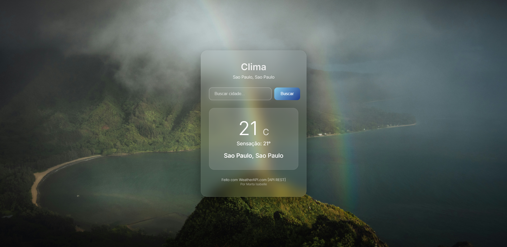

# Weather App



Aplicação web de clima com geolocalização automática, busca global de cidades e animações contextuais.

**Demo:** [Weather App](https://weather-app-eight-ashen-97.vercel.app/)

## Sobre o projeto

Criei esta aplicação para praticar consumo de APIs REST com JavaScript puro. O que começou como um exercício simples evoluiu para um projeto com busca inteligente, ícones climáticos SVG customizados e animações em canvas — tudo sem frameworks.

## Funcionalidades

- **Geolocalização automática** — detecta a cidade do usuário via HTML5 Geolocation API
- **Botão de relocalização** — permite retornar à localização atual a qualquer momento
- **Busca global com autocomplete** — sugere cidades em tempo real com debounce de 260ms; aceita nomes em português ou inglês
- **Correção de nomes brasileiros** — a API de busca não armazena acentos; um mapa local corrige automaticamente "Sao Paulo" → "São Paulo", "Mossoro" → "Mossoró", "Paraiba" → "Paraíba" e todos os 26 estados
- **Navegação por teclado** — autocomplete navegável com ↑ ↓ Enter Escape
- **Ícones SVG inline** — 14 condições climáticas cobertas com ícones vetoriais próprios: ensolarado, noite clara, parcialmente nublado, nublado, neblina, chuvisco, chuva, chuva forte, tempestade, granizo, neve, chuva com gelo e mais
- **Canvas contextual** — animação sutil no fundo do card muda conforme o clima: chuva cai, neve flutua, estrelas piscam à noite, partículas de sol no dia limpo, flash de relâmpago em tempestades. Roda a 30fps e pausa quando a aba não está visível
- **Dados exibidos** — temperatura (°C), sensação térmica, condição climática, cidade, região, umidade, velocidade do vento, índice UV, máxima e mínima reais do dia
- **Card de tamanho fixo** — altura fixa via CSS variable; não muda entre os estados de loading, resultado e erro
- **Skeleton loading** — placeholder animado preenche o card enquanto os dados chegam
- **Design responsivo** — funciona em mobile, tablet e desktop
- **Acessibilidade** — `aria-live`, `aria-label`, `role="listbox"`, `prefers-reduced-motion`

## O que aprendi

- Consumir e encadear múltiplas APIs diferentes num mesmo fluxo: busca de cidades (WeatherAPI) → clima atual com máx/mín reais (Open-Meteo) → reverse geocode para geolocalização
- Disparar buscas em paralelo com `Promise.all` e mesclar/deduplicar resultados para melhorar cobertura sem aumentar latência
- Identificar e corrigir problemas de encoding causados por funções deprecated (`escape()`) sem introduzir novas regressões
- Entender por que remover acentos de uma query de busca pode retornar a cidade errada — e resolver com multi-variante em paralelo
- Desenhar e animar elementos em `<canvas>` com controle de FPS e pausa por visibilidade (`visibilitychange`)
- Criar ícones SVG do zero mapeados para os códigos WMO (World Meteorological Organization)
- Implementar debounce, navegação por teclado e UX de autocomplete sem bibliotecas

## Stack

| Camada | Tecnologia |
|---|---|
| Markup | HTML5 semântico |
| Estilo | CSS3 — glassmorphism, variáveis CSS, animações |
| Lógica | Vanilla JavaScript (ES2022) |
| Busca de cidades | [WeatherAPI.com](https://www.weatherapi.com/) — endpoint `/search` |
| Clima atual | [Open-Meteo](https://open-meteo.com/) — sem API key, padrão WMO |
| Fontes | Google Fonts — DM Serif Display + DM Sans |
| Deploy | Vercel |

Sem frameworks, sem bundlers, sem dependências de terceiros em runtime.

## Como rodar localmente

```bash
git clone https://github.com/martaisabelle/weather-app.git
cd weather-app
# Abra index.html no navegador — não precisa de servidor
open index.html
```

Desenvolvido por **Marta Isabelle**
